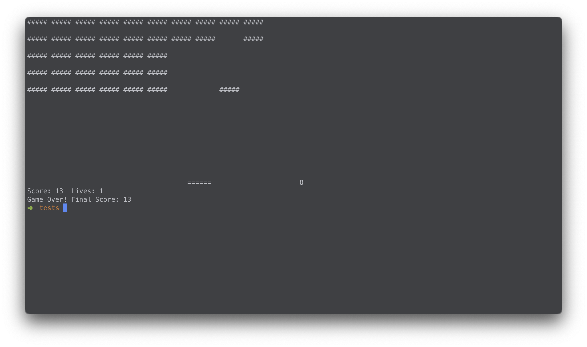

# mini-games
A collection of small games made in different programming languages


### Breakout



Run the `breakout.c` code with the following commands:
```sh
gcc breakout.c -o breakout
```

Enjoy :)
